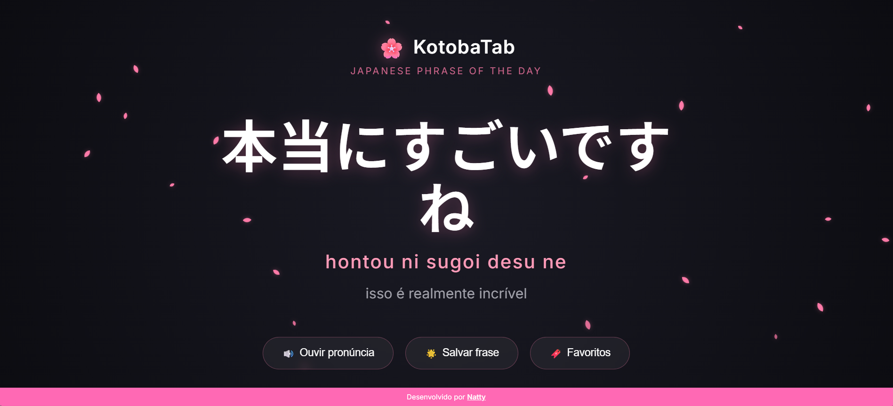
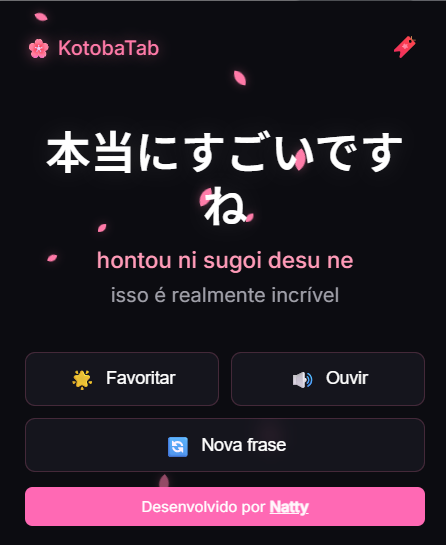
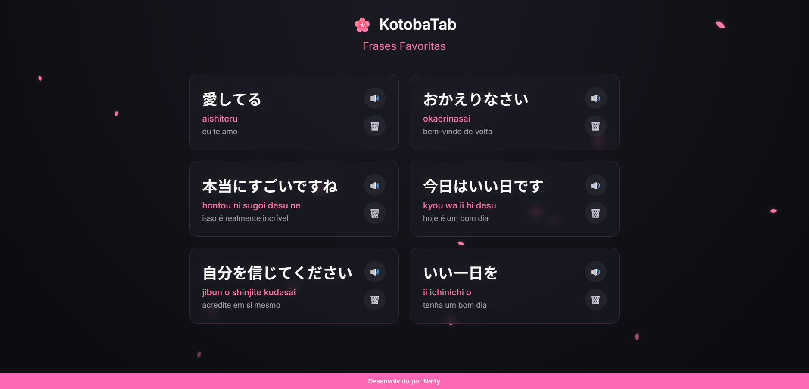

# 🌸 KotobaTab

KotobaTab é uma extensão moderna para Google Chrome inspirada na cultura japonesa, com um elegante tema noturno e detalhes de sakura (flores de cerejeira). 

Ela substitui a nova guia padrão do navegador, trazendo **uma nova frase em japonês por dia** para te ajudar a praticar o idioma de forma imersiva e sem esforço, diretamente no seu navegador.

---

## ✨ Funcionalidades

- 🌙 **Tema Dark Sakura Aesthetic**: Design bonito, moderno e minimalista focado na leitura com um efeito de sakuras caindo ao fundo.
- 🎯 **Frase do Dia na Nova Guia**: A cada dia, uma frase útil em japonês é selecionada com o Romaji (leitura) e a Tradução em português.
- 🔊 **Pronúncia em Áudio**: Escute as frases em japonês nativo utilizando a Web Speech API com o clique de um botão.
- ⭐ **Sistema de Favoritos**: Salve suas frases preferidas clicando na estrela e acesse-as facilmente mais tarde.
- 🚀 **Popup Prático**: Além de estar na nova guia, a extensão também possui um popup (ativo ao clicar no ícone) que mostra a frase atual, permite ouvir, favoritar ou sortear rapidamente uma nova frase aleatória.

---

## 📸 Screenshots

- Visual da Nova Guia

    

- Visual do Popup

    

- Visual da lista de favoritos

    

---

## 🛠️ Tecnologias Utilizadas

O projeto foi construído utilizando as tecnologias web padrões e modernas, e é compatível com o Chrome Extensions **Manifest V3**.
- HTML5
- CSS3 (Vanilla + Variáveis Nativas)
- JavaScript (ES6 Modules)
- Google Chrome Extension API (`chrome.storage.local`, `chrome.tabs`)
- Web Speech API (Text-to-Speech)

---

## ⚙️ Como Instalar e Testar

Siga os passos abaixo para carregar essa extensão no seu Google Chrome em modo de desenvolvedor:

1. Faça o clone ou o download deste repositório para a sua máquina e extraia os arquivos.
   ```bash
   git clone https://github.com/seu-usuario/kotobatab.git
   ```

2. Abra o Google Chrome.

3. Digite `chrome://extensions/` na barra de endereços (URL) e pressione Enter.

4. Habilite o "Modo do desenvolvedor" (Developer mode) ativando a chave seletora localizada no canto superior direito da tela de Extensões.

5. Clique no botão **"Carregar sem compactação" (Load unpacked)** que vai aparecer no canto superior esquerdo.

6. Selecione a pasta onde você baixou/clonou este projeto (a pasta que contém o arquivo `manifest.json` chamada `kotobatab-extension`).

7. A extensão será instalada! Fixe (Pin) ela na barra de extensões no botão de "quebra-cabeças" do Chrome. 

8. **Pronto!** Teste clicando no ícone da extensão ou abrindo uma Nova Guia (Ctrl+T) para ver o resultado.

---

## 📁 Estrutura do Projeto

```text
kotobatab-extension/
│
├── manifest.json       # Configuração da extensão (Manifest V3)
├── README.md           # Este arquivo
│
├── favorites/
│   ├── favorites.html  # Página de frases salvas
│   ├── favorites.css   # Estilos dos cards e página
│   └── favorites.js    # Lógica de renderização
│
├── icons/              # Ícones da extensão nos tamanhos padrões
│   ├── icon16.png
│   ├── icon48.png
│   └── icon128.png
│
├── screenshots/        # Screenshots usadas no README
│   ├── screenshot_newtab.png
│   ├── screenshot_popup.png
│   └── screenshot_favorites.png
│
├── newtab/
│   ├── newtab.html     # HTML que substitui a nova guia
│   ├── newtab.css      # Estilização da nova guia em full screen
│   └── newtab.js       # Controle de comportamento na tab
│
├── popup/
│   ├── popup.html      # Interface visível ao clicar no ícone
│   ├── popup.css       # Estilo do frame de popup
│   └── popup.js        # Lógica de exibição simples do popup
│
└── shared/
    ├── styles.css      # Variáveis, fontes, animações e componentes comuns
    └── utils.js        # Funções para leitura do JSON, fetch de data, storage (favoritos) e áudio
```

---

## 📝 Licença

Este projeto é de código aberto e possui a licença MIT.
